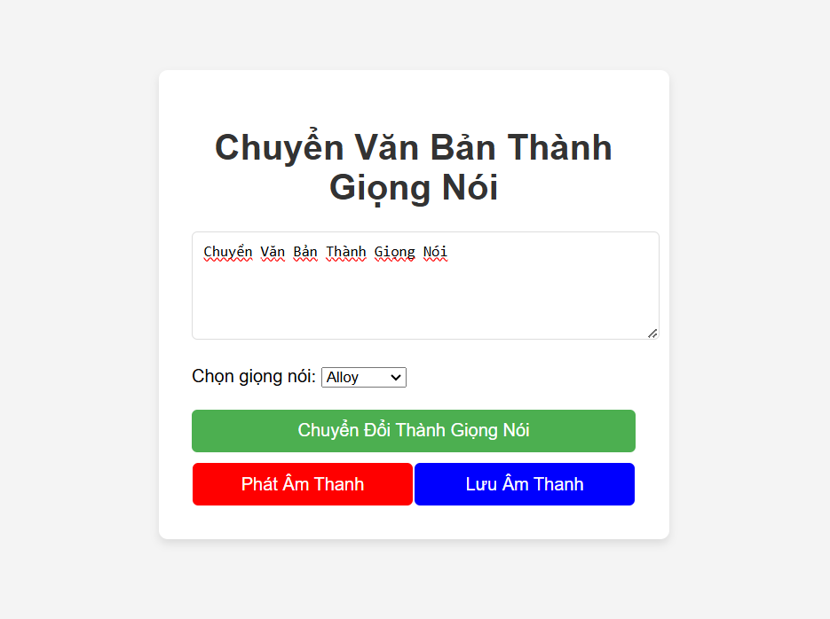

This is a small tool I created to convert text to speech using OpenAI's API.



# Project Setup Guide

### Step 1: Install Dependencies
Run the following command to install all necessary packages: `npm install`

### Step 2: Configure Environment Variables
Create a new .env file in the root of the project, then add the following line, replacing *\<<your-open-ai-key\>>* with your actual OpenAI API key:

```OPENAI_API_KEY=<<your-open-ai-key>>```

*Note: Ensure that the .env file is saved in the root directory and not committed to version control for security reasons.*

### Step 3: Start Development Server
Run this command to start the development server: `npm run dev`. Then, open your browser and go to [http://localhost:3000](http://localhost:3000).